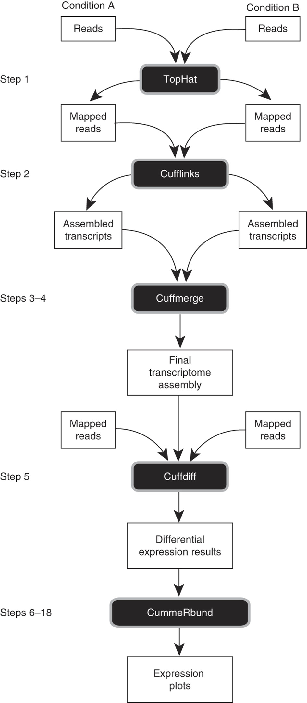

# De novo transcriptomic assembly using Trinity
[TRINITY](https://github.com/trinityrnaseq/trinityrnaseq/wiki) is a great tool for building a *de novo* transcriptome assembly RNASeq data. The linked webpage has several tutorials to install, run and troubleshoot trinity. However, these were quite simplified examples and it took a bit of effort to wrap my head completely around everything. In addition, there are pre-processing steps which need to be followed before working on the TRINITY pipeline. Here I is my description of a *de novo* transcriptomic assembly for *Lycaeides melissa* in detail, so that there is a record and that it is easy to use this as a guide to build an assembly using RNASeq data in the future. In addition, this can be referred to as a reseource for finding great resources for tutorials on installations and running sample datasets. 

**Installation Software prerequisites:**
1. [samtools](http://samtools.sourceforge.net/) open-version 1.5 installed on the UofU CHPC. 
2. [bowtie2](http://bowtie-bio.sourceforge.net/bowtie2/index.shtml) version open-2.2.9 installed on the UofU CHPC.
2. [jellyfish](http://www.genome.umd.edu/jellyfish.html) CHPC version 2.2.9 locally installed on UofU.
3. [salmon](https://salmon.readthedocs.io/en/latest/salmon.html) version 0.9.1 locally installed on UofU.

Programs for post-processing of Trinity output files
1. [SWISSPROT](https://www.uniprot.org/) to run blastx on the trinity output files.

/uufs/chpc.utah.edu/sys/installdir/trinity/2.6.6/util/TrinityStats.pl Trinity.fasta


################################
## Counts of transcripts, etc.
################################
Total trinity 'genes':	167323
Total trinity transcripts:	323046
Percent GC: 40.91

########################################
Stats based on ALL transcript contigs:
########################################

	Contig N10: 4240
	Contig N20: 2998
	Contig N30: 2311
	Contig N40: 1807
	Contig N50: 1386

	Median contig length: 362
	Average contig: 729.78
	Total assembled bases: 235752177


#####################################################
## Stats based on ONLY LONGEST ISOFORM per 'GENE':
#####################################################

	Contig N10: 3960
	Contig N20: 2607
	Contig N30: 1848
	Contig N40: 1263
	Contig N50: 819

	Median contig length: 271
	Average contig: 517.68
	Total assembled bases: 86619651

# Reference based transcriptomic assembly using TopHat and Cufflinks
This is to assemble and identify the transcripts, and identifying the number of hits for each transcript and the genes they represent. For this, we need a reference genome. To do this, I map the reads to the reference genome using `Tophat` (http://ccb.jhu.edu/software/tophat/manual.shtml), then I assemble the overlapping and spaced mapped patterns in the BAM files, into exons and transcripts with `Cufflinks`. `Cufflinks` outputs a file to lay out the transcripts in reference to the genome. These giles can be merged into a single consolidated file and matched up with the existing genome annotation with Cuffmerge. Then, CuffDiff can be used to determine differential expression between different conditions represented by different group files. Tophat and Cufflinks do the main transcriptome assembly, but Cuffmerge contributes to the final arrangement of the output sequences.
Here is a basic flowchart of how this process works:


To build this assembly, we first need to index the genome using bowtie. 

Here is the command I used to do this:

```bash
module load bowtie2
bowtie2-build melissa_ref.fa melissa
```
*Note we need to provide a name like "melissa" which is a prefix for all output files*

Now we can do alignments using `Tophat`. I used Tophat version 2.6.6. Here is an example bash script I used to run tophat:

```bash
#!/bin/bash
#SBATCH --job-name=tophat
#SBATCH --time=120:00:00 #walltime
#SBATCH --nodes=1 #number of cluster nodes
#SBATCH --account=usubio-kp #PI account
#SBATCH --partition=usubio-kp #specify computer cluster, other option is kinspeak

cd /uufs/chpc.utah.edu/common/home/gompert-group1/data/lycaeides/matt_transcriptome/tophat/

module load bowtie2
module load bowtie

./tophat-2.1.1.Linux_x86_64/tophat -I 1000 -i 20 -o outdir/ ../reference/melissa ../trim_galore/KS001_S71_L008_R1_001_val_1.fq,../trim_galore/KS002_S72_L008_R1_001_val_1.fq,../trim_galore/KS003_S73_L008_R1_001_val_1.fq,../trim_galore/KS001_S71_L008_R2_001_val_2.fq,../trim_galore/KS002_S72_L008_R2_001_val_2.fq,../trim_galore/KS003_S73_L008_R2_001_val_2.fq
```
This script will create output files in the out directory (outdir).